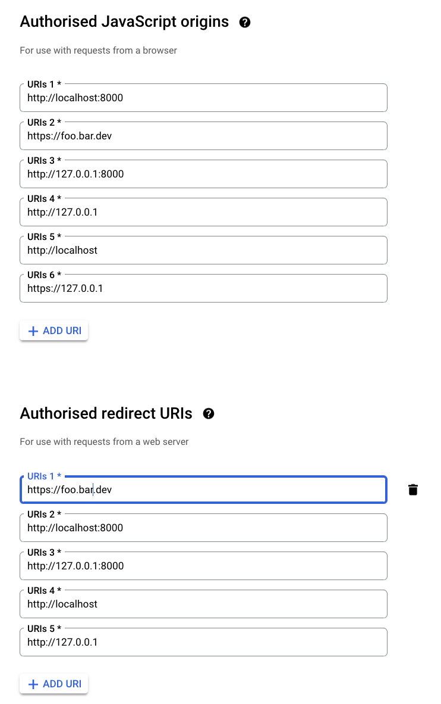

# Google Auth Template

This project demonstrates how to implement Google Authentication in a Flask application.

## Setup

1. Clone this repository
2. Install the required packages:
   ```
   pip install -r requirements.txt
   ```
3. Set up a Google Cloud Project and configure the OAuth consent screen
4. Create OAuth 2.0 Client IDs for your application
5. Add your Google Client ID to the `.env` file:
   ```
   GOOGLE_CLIENT_ID=your_client_id_here
   ```

## Google Console Settings

Here's a screenshot of the Google Console settings for this project:



## Running the Application

Run the Flask application:

```
python app.py
```
or
```
gunicorn app:app
``` 

## Note on Local Testing

For some reason, the authentication works when accessing the application via `localhost:8000`, but not when using `127.0.0.1:8000`. This issue needs further investigation.

## Project Structure

- `app.py`: Main Flask application
- `index.html`: Frontend HTML template
- `auth.js`: JavaScript for handling Google authentication
- `.env`: Environment variables (not tracked in git)

## Contributing

Contributions are welcome! Please feel free to submit a Pull Request.

## License

This project is open source and available under the [MIT License](LICENSE).
